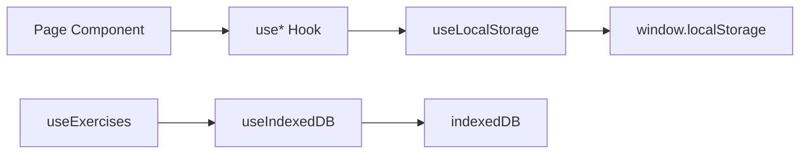

## Exploration: Supabase Auth + Data Layer

### Current State

**Architecture**: 100% local-first. All data lives in `localStorage` (7 keys) and `IndexedDB` (exercise images). No server, no auth, no network calls.

**Data flow**: React hooks (`useWorkouts`, `useExercises`, `useSessions`, `useSequences`, `useWeekPlans`, `useProgramTemplates`, `useFavorites`) read/write directly to `localStorage` via a shared `useLocalStorage<T>()` SSR-safe hook. Only `useWorkouts` is wrapped in a `WorkoutContext` provider; every other hook is consumed directly in pages.



**Test patterns**: Vitest + jsdom, `renderHook` + `act(@testing-library/react)`, native localStorage mock via jsdom, `fake-indexeddb` for IndexedDB tests. No Supabase packages exist in `package.json`.

**Supabase infra**: Local Supabase already running (ports 54321 API, 54322 DB, 54323 Studio). Auth enabled (email/password, confirmations off), Storage enabled (50MiB). Postgres 17. No migrations or seed data yet.

**No middleware.ts exists** — all routes are public, unauthenticated.

### Affected Areas

| File | Why affected |
|------|-------------|
| `package.json` | Add `@supabase/ssr`, `@supabase/supabase-js` |
| `.env.local` | Add `NEXT_PUBLIC_SUPABASE_URL`, `NEXT_PUBLIC_SUPABASE_ANON_KEY` (create) |
| `middleware.ts` | New — session refresh + route protection |
| `src/lib/supabase/client.ts` | New — browser client singleton |
| `src/lib/supabase/server.ts` | New — server client factory |
| `src/lib/supabase/middleware.ts` | New — middleware client factory |
| `src/lib/supabase/migrate-local.ts` | New — one-time localStorage → Supabase migration |
| `src/lib/supabase/__tests__/` | New — client mock + migration tests |
| `src/context/AuthContext.tsx` | New — auth state provider (user, session, signIn, signUp, signOut) |
| `src/hooks/useWorkouts.ts` | Rewrite — call Supabase instead of localStorage |
| `src/hooks/useExercises.ts` | Rewrite — call Supabase + Storage for images |
| `src/hooks/useSessions.ts` | Rewrite — append-only → Supabase insert |
| `src/hooks/useSequences.ts` | Rewrite — Supabase CRUD |
| `src/hooks/useWeekPlans.ts` | Rewrite — Supabase CRUD |
| `src/hooks/useProgramTemplates.ts` | Rewrite — Supabase CRUD |
| `src/hooks/useFavorites.ts` | Rewrite — Supabase row-based instead of localStorage array |
| `src/hooks/useIndexedDB.ts` | Replace — move image storage to Supabase Storage |
| `src/context/WorkoutContext.tsx` | Minor — wrap with auth guard or keep as-is |
| `src/app/layout.tsx` | Add `AuthProvider` wrapping `WorkoutProvider` |
| `src/app/login/page.tsx` | New — login/register page |
| `src/app/auth/callback/route.ts` | New — OAuth callback handler |
| `src/types/workout.ts` | Maybe — add `user_id` to types or keep as runtime concern |
| `supabase/migrations/` | New — SQL migration files for schema + RLS |
| `supabase/seed.sql` | Update — seed public exercises |

### Approaches

**Option A: Supabase SSR package with service layer**

Use `@supabase/ssr` for both server and browser clients. Create a thin service module (`src/lib/supabase/`) that exports factory functions. Hooks call Supabase directly via the browser client. Auth is managed via `AuthContext` + middleware.

```
src/lib/supabase/
├── client.ts       # createBrowserClient (singleton)
├── server.ts       # createServerClient (per-request factory)
├── middleware.ts    # createServerClient for middleware
└── migrate-local.ts # localStorage → Supabase migration
```

- Pros: Official Supabase SSR pattern, proven with Next.js, SSG/SSR safe, cookie-based auth works out of the box
- Cons: Requires middleware.ts, adds ~15KB to bundle, server/client client separation adds some boilerplate
- Effort: **Medium** — well-documented, but requires understanding SSR cookie lifecycle

**Option B: Simple `@supabase/supabase-js` client in service layer, hooks call service**

Use only `@supabase/supabase-js` (no SSR package). Create one browser client. Auth via `AuthContext` + checking `getSession()`. No server components, no middleware.

- Pros: Fewer dependencies, simpler mental model, works fine for a SPA-like Next.js app
- Cons: No SSR cookie refresh, refresh tokens race with page loads, no server-side auth for future API routes, doesn't follow Supabase recommended patterns
- Effort: **Low** initially, but grows risk as features expand

**Option C: Supabase as primary, localStorage as offline cache (hybrid)**

Full hybrid: Supabase is source of truth, localStorage is read-through cache for offline. Hooks try Supabase first, fall back to localStorage on network error. Sync on reconnect.

- Pros: Offline resilience, instant UI on cached data
- Cons: **Severe** complexity — conflict resolution, stale data detection, sync state machine, double the test surface. Premature for an MVP that currently has zero network expectations.
- Effort: **Very High** — not justified at this stage

### Recommendation

**Choose Option A.**

Why:
1. The app already uses Next.js App Router with server components (layout.tsx is a server component). Using `@supabase/ssr` is the architecturally correct fit.
2. The roadmap explicitly mentions "decidir si usar cache local como fallback" — committing to hybrid now is premature. Build Option A first, add offline cache layer later if real user data shows network issues.
3. Supabase SSR package is the recommended path and has been stable since 2024. The middleware pattern for session refresh is mandatory for production auth flows.
4. The effort difference from Option B is tiny once you write the factory files — the real work is in the hook rewrites, which are the same either way.

**Database Schema**:

```sql
-- Enable UUID generation
create extension if not exists "pgcrypto";

-- 1. Workouts
create table workouts (
  id uuid primary key default gen_random_uuid(),
  user_id uuid not null references auth.users(id) on delete cascade,
  title text not null,
  description text,
  image_url text,
  intervals jsonb not null default '[]'::jsonb,
  created_at timestamptz not null default now(),
  updated_at timestamptz not null default now()
);
create index workouts_user_id_idx on workouts(user_id);

-- 2. Exercises (public seed + user-created)
create table exercises (
  id uuid primary key default gen_random_uuid(),
  user_id uuid references auth.users(id) on delete cascade, -- null = public seed
  name text not null,
  description text,
  primary_muscles text[] not null default '{}',
  secondary_muscles text[] not null default '{}',
  equipment text[] not null default '{}',
  instructions text[] not null default '{}',
  force text check (force in ('push', 'pull', 'static')),
  mechanic text check (mechanic in ('compound', 'isolation')),
  difficulty text check (difficulty in ('beginner', 'intermediate', 'advanced')),
  images text[] not null default '{}', -- Supabase Storage URLs
  source text not null default 'user' check (source in ('user', 'free-exercise-db')),
  category text not null,
  created_at timestamptz not null default now(),
  updated_at timestamptz not null default now()
);
create index exercises_user_id_idx on exercises(user_id);

-- 3. Sequences (ordered list of workouts)
create table sequences (
  id uuid primary key default gen_random_uuid(),
  user_id uuid not null references auth.users(id) on delete cascade,
  title text not null,
  description text,
  workout_ids uuid[] not null default '{}',
  repeat_count int not null default 1,
  created_at timestamptz not null default now(),
  updated_at timestamptz not null default now()
);
create index sequences_user_id_idx on sequences(user_id);

-- 4. Sessions (completed workout logs)
create table sessions (
  id uuid primary key default gen_random_uuid(),
  user_id uuid not null references auth.users(id) on delete cascade,
  type text not null check (type in ('workout', 'sequence')),
  workout_id uuid references workouts(id) on delete set null,
  sequence_id uuid references sequences(id) on delete set null,
  started_at timestamptz not null,
  completed_at timestamptz,
  intervals jsonb not null default '[]'::jsonb,
  created_at timestamptz not null default now()
);
create index sessions_user_id_idx on sessions(user_id);
create index sessions_started_at_idx on sessions(started_at desc);

-- 5. Week Plans
create table week_plans (
  id text primary key, -- "week-{YYYY-MM-DD}" computed key
  user_id uuid not null references auth.users(id) on delete cascade,
  title text,
  start_date date not null,
  days jsonb not null default '[null,null,null,null,null,null,null]'::jsonb,
  created_at timestamptz not null default now(),
  updated_at timestamptz not null default now()
);
create index week_plans_user_id_idx on week_plans(user_id);

-- 6. Program Templates
create table program_templates (
  id uuid primary key default gen_random_uuid(),
  user_id uuid not null references auth.users(id) on delete cascade,
  title text not null,
  description text,
  days jsonb not null default '[]'::jsonb,
  created_at timestamptz not null default now(),
  updated_at timestamptz not null default now()
);
create index program_templates_user_id_idx on program_templates(user_id);

-- 7. Favorites
create table favorites (
  id uuid primary key default gen_random_uuid(),
  user_id uuid not null references auth.users(id) on delete cascade,
  exercise_id uuid not null references exercises(id) on delete cascade,
  created_at timestamptz not null default now(),
  unique(user_id, exercise_id)
);
create index favorites_user_id_idx on favorites(user_id);

-- RLS: every table is user-scoped
-- (actual policies use the wrapped (select auth.uid()) pattern for perf)

alter table workouts enable row level security;
alter table exercises enable row level security;
alter table sequences enable row level security;
alter table sessions enable row level security;
alter table week_plans enable row level security;
alter table program_templates enable row level security;
alter table favorites enable row level security;

-- User owns their data
create policy "Users own their workouts"
  on workouts for all using ((select auth.uid()) = user_id);

-- Exercises: public seed OR owned
create policy "Read public or own exercises"
  on exercises for select
  using (user_id is null or (select auth.uid()) = user_id);

create policy "Users manage own exercises"
  on exercises for insert with check ((select auth.uid()) = user_id);
create policy "Users update own exercises"
  on exercises for update using ((select auth.uid()) = user_id);
create policy "Users delete own exercises"
  on exercises for delete using ((select auth.uid()) = user_id);

-- Rest follow same pattern
create policy "Users own their sequences"
  on sequences for all using ((select auth.uid()) = user_id);
create policy "Users own their sessions"
  on sessions for all using ((select auth.uid()) = user_id);
create policy "Users own their week plans"
  on week_plans for all using ((select auth.uid()) = user_id);
create policy "Users own their templates"
  on program_templates for all using ((select auth.uid()) = user_id);
create policy "Users own their favorites"
  on favorites for all using ((select auth.uid()) = user_id);
```

**Auth strategy**:
- Email + password for MVP (Supabase Auth built-in)
- `AuthContext` wrapping the app: exposes `user`, `session`, `signIn()`, `signUp()`, `signOut()`
- `middleware.ts` refreshes session on every request and redirects unauthenticated users to `/login` for protected routes
- Protected routes: everything except `/login`, `/auth/callback`, and public assets
- Session persistence: Supabase SSR cookie (httpOnly, secure, sameSite=lax)

**Data migration**:
- On first login, `migrate-local.ts` checks `localStorage` for existing keys
- If data exists, INSERT each entity to Supabase with the migration timestamp
- Set `localStorage.setItem('workoutapp.migrated', 'true')` to prevent re-migration
- User gets a one-time "Migrating your data..." toast; afterward, localStorage data is stale but kept as read-only fallback until Phase 3.2 cleans it up
- Images in IndexedDB: upload each to Supabase Storage bucket `exercise-images`, update exercise records with Storage URLs

**Test strategy**:
- Mock `@supabase/ssr` at module level: `vi.mock('@supabase/ssr', () => ({ createBrowserClient: vi.fn() }))`
- Create a `createClientMock()` helper that returns mock `from()`, `auth`, `storage` chains
- Auth tests: mock `supabase.auth.signInWithPassword`, `supabase.auth.signUp`, `supabase.auth.signOut`, `supabase.auth.getSession`
- Data hook tests: keep existing `renderHook` + `act` pattern, swap localStorage assertions for Supabase mock assertions
- Example structure for a mocked hook test:

```typescript
import { vi, describe, it, expect } from 'vitest'
import { renderHook, act } from '@testing-library/react'

const mockFrom = vi.fn()
vi.mock('@supabase/ssr', () => ({
  createBrowserClient: () => ({
    from: mockFrom,
    auth: { getSession: vi.fn() },
  }),
}))

// Then mock the chain: mockFrom().select().eq().single() etc.
```

### Risks

1. **Next.js 16 + `@supabase/ssr` compatibility** — This is the current Next.js version (16.2.9) and React 19. The Supabase SSR package's peer dependency range must include React 19 and Next.js 16. Verify before installing. If compatibility issues exist, fall back to `@supabase/supabase-js` (Option B).

2. **Seed data ownership** — The current 20 free-exercise-db exercises are injected on first load. In a multi-tenant Supabase model, these should be public rows (user_id = null) seeded via migration, not per-user. The seed script must be refactored into a Supabase migration + seed.sql job.

3. **Test isolation** — Currently all data tests use real localStorage (jsdom-native). Switching to mocked Supabase means tests no longer verify real persistence behavior — they verify mock chain calls. Consider adding integration tests against the local Supabase instance for critical paths.

4. **Session timing** — `useLocalStorage` is instant synchronous. Supabase DB calls are async network requests. All UI code that reads from hooks will need loading states and error handling for the first time. This is a UX regression risk — add `<Suspense>` boundaries or skeleton states as part of the hook rewrite.

5. **Interval/JSONB queryability** — Embedding intervals as JSONB means you can't query "all workouts that use exercise X" via SQL. This is an intentional ponytail: intervals are always fetched with their parent and never queried independently. If that changes, normalize intervals into their own table.

6. **WorkoutContext scope** — Currently only wraps `useWorkouts`. If we add Supabase calls with loading states, the context may need to expose loading/error state too, or components will need their own local state per hook.

7. **Storage cost** — Exercise images (currently 10MB cap in IndexedDB) move to Supabase Storage. For a free-tier Supabase project, Storage is 1GB total. This is fine for MVP but worth noting.

### Ready for Proposal

Yes. The exploration is complete — the schema, auth flow, test strategy, migration path, and risks are all identified. The orchestrator should proceed to **sdd-propose** with Option A (Supabase SSR service layer) as the recommended approach.

The first SDD change is `supabase-auth-data-layer`, which will deliver:
1. Migration SQL (schema + RLS + seed) → `supabase/migrations/`
2. Supabase client factories → `src/lib/supabase/`
3. Auth context + login page → `src/context/AuthContext.tsx`, `src/app/login/`
4. Middleware → `middleware.ts`
5. localStorage → Supabase migration script
6. Rewritten hooks → `src/hooks/use*.ts` (one per logical type)
7. Updated tests
